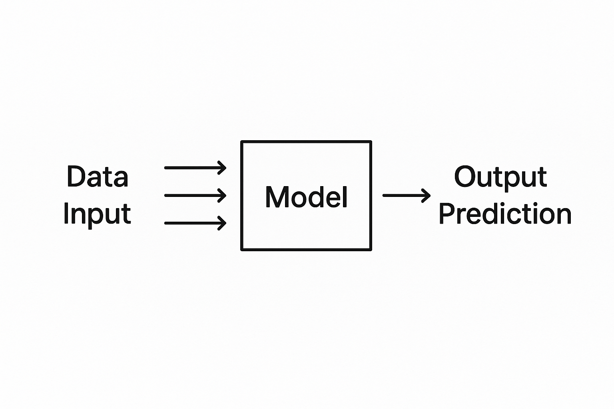

# Chapter 1: What is AI, ML, DL, LLM?

#### Understanding Artificial Intelligence (AI)

**Artificial Intelligence (AI)** is the broadest concept in this family of technologies. Think of AI as any computer system designed to perform tasks that typically require human intelligence\[1]\[2]. This includes activities like reasoning, learning, problem-solving, perception, and decision-making\[3].

AI doesn't necessarily mean robots or super-intelligent machines from science fiction movies. Instead, it's about creating systems that can **mimic human cognitive functions**\[1]. These systems can be as simple as a rule-based chess program or as complex as modern voice assistants like Siri and Alexa\[4].

**Types of AI:**

* **Narrow AI** (or Weak AI): Designed to perform specific tasks, like facial recognition or language translation\[5]
* **General AI**: A theoretical future AI that could handle any intellectual task a human can do\[5]
* **Super AI**: A hypothetical AI that would surpass human intelligence in all areas\[2]

Currently, all AI systems we interact with daily are examples of Narrow AI\[2]\[5].

#### Machine Learning (ML): AI That Learns

**Machine Learning** is a subset of AI that focuses on creating systems that can **learn and improve automatically from data without being explicitly programmed**\[3]\[6]. Instead of following pre-written rules, ML algorithms identify patterns in data and make predictions or decisions based on these patterns\[7].

Think of machine learning like teaching a child to recognize animals. Instead of describing every feature of a cat, you show the child hundreds of cat pictures. Eventually, the child learns to identify cats on their own by recognizing common patterns\[8].

**Key characteristics of Machine Learning:**

* **Learning from experience**: Performance improves as more data is processed\[9]
* **Pattern recognition**: Identifies relationships and trends in data\[10]
* **Automatic adaptation**: Adjusts behavior based on new information\[9]

**Common ML algorithms include:**

* Decision Trees
* Support Vector Machines
* Random Forests
* Linear Regression\[7]\[11]

#### Deep Learning (DL): Mimicking the Human Brain

<figure><figcaption></figcaption></figure>

**Deep Learning** is a specialized subset of Machine Learning that uses **artificial neural networks with multiple layers** to automatically learn complex patterns from large amounts of data\[7]\[12]. The term "deep" refers to the multiple layers of interconnected nodes (artificial neurons) that process information\[9].\
Deep learning is **inspired by the structure and function of the human brain**\[12]. Just as our brains have billions of interconnected neurons that process information, deep learning models have artificial neurons arranged in layers that work together to understand complex patterns\[13].

**What makes Deep Learning special:**

* **Automatic feature extraction**: Unlike traditional ML, deep learning doesn't require manual feature engineering\[7]
* **Handles unstructured data**: Excels at processing images, audio, and text\[14]
* **Multiple layers**: Can have hundreds of hidden layers that learn increasingly complex representations\[12]

**Common Deep Learning architectures:**

* **Convolutional Neural Networks (CNNs)**: Best for image recognition\[7]
* **Recurrent Neural Networks (RNNs)**: Ideal for sequential data like speech and text\[7]
* **Transformers**: Revolutionized natural language processing\[7]

#### Large Language Models (LLMs): AI That Understands Language

**Large Language Models (LLMs)** are a specific type of deep learning model that specializes in **understanding and generating human language**\[2]. These models are trained on massive amounts of text data from books, websites, and other sources to learn the patterns, grammar, and context of human language\[15].

**What makes LLMs "large":**

* **Massive parameter counts**: Modern LLMs like GPT-4 have over a trillion parameters\[16]
* **Enormous training datasets**: Trained on terabytes of text from diverse sources\[15]
* **Complex transformer architecture**: Uses advanced neural network designs for language processing\[7]

**Popular LLMs include:**

* ChatGPT and GPT-4 (OpenAI)
* Google Bard and Gemini
* Claude (Anthropic)
* Meta's LLaMA series\[17]

<figure><figcaption></figcaption></figure>

#### The Relationship Between These Technologies

Understanding how these technologies relate to each other is crucial. **AI is the umbrella term**, with Machine Learning as its most prominent subset. **Deep Learning is a subset of Machine Learning** that uses neural networks, and **LLMs are a specific application of Deep Learning** focused on language tasks\[9]\[18].

This hierarchy means:

* All Deep Learning is Machine Learning, but not all Machine Learning is Deep Learning
* All LLMs use Deep Learning, but Deep Learning has many other applications
* All Machine Learning is AI, but AI includes non-learning approaches too\[7]\[5]

